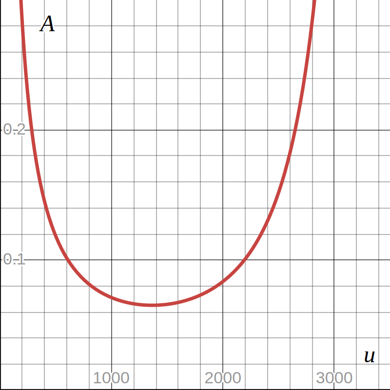

# The area-Mach number relation

Since we now have an equation relating the speed and density, we can replace the density in the conservation of mass equation to get an equation relating area and speed. We start by solving for the static pressure in the stagnation-to-static density relation:

$$\rho = \rho_0 \left(1 - \frac{u^2}{2 c_p T_0}\right)^\frac{1}{\gamma - 1}$$

And inserting this into the conservsation of mass equation before solving for area:

$$\dot m = \rho u A$$
$$\dot m = \left(1 - \frac{u^2}{2 c_p T_0}\right)^\frac{1}{\gamma - 1} \rho_0 u A \Rightarrow$$
$$A = \frac{\dot m}{\rho_0 u} \left(1 - \frac{u^2}{2 c_p T_0}\right)^\frac{1}{1 - \gamma}$$

Here we get our first glimpse of why CD-nozzles are shaped like they are. The speed appears in two places and is raised to all sorts of powers. This just screams "i have a minimum", and looking at the graph, we se that it in fact does have a minimum:

This is quite remarkable. Going from high cross-sectional area to lower cross-sectional area, the speed first increases as intuitively expected, but only up to a certain point where the area is at a minimum (around $1200$ m/s on the graph). From here on out, achieving higher speed (and by extension, lower pressure, density and temperature) actually requires expanding the cross-sectional area again! Looking at the equation, it is apparent that the $\frac{\dot m}{u}$ factor will keep trying to drag the area down as the speed increases, but apparently the $\frac{1}{\rho_0}\left(1 - \frac{u^2}{2 c_p T_0}\right)^\frac{1}{1 - \gamma}$ factor (which is just the inverse of density) begins growing so fast (that is, the density falls so fast) that it overpowers the other term and drags up the area.

If you just wanted to know why CD-nozzles have a diverging section, this is your answer. To achieve higher speeds, and lower pressure, density and temperature, there needs to be a minimal area in the nozzle after which the cross-sectional area expands again.

It turns out that the speed that occurs at the minimum area is such that the speed of the gas is equal to the local speed of sound, that is, it is going Mach 1. The speed of sound in a gas $a$ is given by:

$$a^2 = \gamma R T$$

As we see, this depends on temperature. This is why it is the _local_ speed of sound, since the temperature of the gas decreases as the speed of the gas increases.

Readers are encouraged to take a look at the [Speed at the minimum area](./side-quests/minimum-area.md) side-quest for a full derivation of the minimum area speed.

## Mach number

The Mach number $M$ (not to be confused with molar mass) is given by the ratio of the flow speed and the local speed of sound:

$$M^2 = \frac{u^2}{\gamma R T}$$

This is a useful quantity to relate the other variables like pressure, temperature and density to. To be able to substitute it into our static-to-stagnation ratio relations, let us solve for $u^2$:

$$u^2 = \gamma R T M^2$$

We now substitute this into the static-to-stagnation temperature ratio relation:

$$\frac{T_0}{T} = \left(1 - \frac{\gamma R T}{2 c_p T_0} M^2\right)^{-1}$$

As we saw in the [Speed at the minimum area](./side-quests/minimum-area.md) side-quest:

$$\gamma R = c_p(\gamma - 1)$$

This can be derived from _Mayer's relation_ which states that $c_p - c_v = R$ and the definition of $\gamma$ (this is left as an exercise to the reader, or you could read the side-quest :wink:).

Substituting this in, we get:

$$\frac{T_0}{T} = \left(1 - \frac{c_p(\gamma - 1) T}{2 c_p T_0} M^2\right)^{-1}$$

The $c_p$'s cancel, and we separate the fraction into two:

$$\frac{T_0}{T} = \left(1 - \frac{T}{T_0} \frac{\gamma - 1}{2} M^2\right)^{-1}$$

We have $\frac{T_0}{T}$ on one side and $\frac{T}{T_0}$ on the other. Let's invert, and move the term on the right-hand side to the left to be able to extract a common factor:

$$\frac{T}{T_0} = 1 - \frac{T}{T_0} \frac{\gamma - 1}{2} M^2$$

$$\frac{T}{T_0} + \frac{T}{T_0} \frac{\gamma - 1}{2} M^2 = 1$$

$$\frac{T}{T_0} \left(1 +  \frac{\gamma - 1}{2} M^2\right) = 1$$

We then invert again, and move the parenthesized expression back to the right-hand side:

$$\boxed{\frac{T_0}{T} = 1 + \frac{\gamma - 1}{2} M^2}$$

What a nice and simple expression. Isn't the Mach number great? Let us substitute this into the isentropic relations to see how the stagnation-to-static pressure and density ratios depend on the Mach number:

$$\boxed{\frac{p_0}{p} = \left(1 + \frac{\gamma - 1}{2} M^2\right)^\frac{\gamma}{\gamma - 1}}$$

$$\boxed{\frac{\rho_0}{\rho} = \left(1 + \frac{\gamma - 1}{2} M^2\right)^\frac{1}{\gamma - 1}}$$

Now we solve for the density in this relation and substitute that into the conservation of mass equation:

$$\rho = \rho_0 \left(1 + \frac{\gamma - 1}{2} M^2\right)^\frac{1}{1 - \gamma}$$

$$\dot m = \rho_0 u A \left(1 + \frac{\gamma - 1}{2} M^2\right)^\frac{1}{1 - \gamma}$$

We would like to replace $u$ with an expression based on the Mach number and stagnation properties too. Let us solve for $u$ in the definiton of the Mach number:

$$u = \sqrt{\gamma R T M^2}$$

Substitute $\gamma R$ as above, and calculate $T$ based on the Mach number using the relation just derived above:

$$u = \sqrt{c_p (\gamma - 1) T_0 M^2 \left(1 + \frac{\gamma - 1}{2} M^2\right)^{-1}}$$

We then multiply and divide the inside of the square root by $2$:

$$u = \sqrt{2 c_p T_0 \frac{\gamma - 1}{2} M^2 \left(1 + \frac{\gamma - 1}{2} M^2\right)^{-1}}$$

Which allows us to pull $\frac{\gamma - 1}{2} M^2$ into the parentheses (by inverting it):

$$u = \sqrt{2 c_p T_0 \left(1 + \left(\frac{\gamma - 1}{2} M^2\right)^{-1}\right)^{-1}}$$

Those two inversions are a little bit annoying, so let us see if we can get rid of them. We start by writing the inversion in fraction form:

$$u=\sqrt{2c_{p} T_{0}\left( 1+\frac{1}{\frac{\gamma -1}{2} M^{2}}\right)^{-1}}$$

Which lets us bring the addition into the fraction and invert that whole fraction:

$$u=\sqrt{2c_{p} T_{0}\left(\frac{1+\frac{\gamma -1}{2} M^{2}}{\frac{\gamma -1}{2} M^{2}}\right)^{-1}}$$

$$u=\sqrt{2c_{p} T_{0}\frac{\frac{\gamma -1}{2} M^{2}}{1+\frac{\gamma -1}{2} M^{2}}}$$

We can now add one and subtract one:

$$u=\sqrt{2c_{p} T_{0}\frac{1+\frac{\gamma -1}{2} M^{2} -1}{1+\frac{\gamma -1}{2} M^{2}}}$$

And split the fraction in two, the left of which becomes $1$:

$$u=\sqrt{2c_{p} T_{0}\left( 1-\frac{1}{1+\frac{\gamma -1}{2} M^{2}}\right)}$$

And lastly we invert again to get:

$$u=\sqrt{2c_{p} T_{0}\left( 1-\left( 1+\frac{\gamma -1}{2} M^{2}\right)^{-1}\right)}$$

This also brings back $1 + \frac{\gamma - 1}{2} M^2$ which is our stagnation to static temperature ratio.

Plugging that into the mass conservation equation gives:

$$\boxed{\dot m = \rho_0 A \left(1 + \frac{\gamma - 1}{2} M^2\right)^\frac{1}{1 - \gamma} \sqrt{2c_{p} T_{0}\left( 1-\left( 1+\frac{\gamma -1}{2} M^{2}\right)^{-1}\right)}}$$

It's not pretty, but no-one said it had to be. Now solving for $A$:

$$\boxed{A = \frac{\dot m}{\rho_0} \left(1 + \frac{\gamma - 1}{2} M^2\right)^\frac{1}{\gamma- 1} \left(2c_{p} T_{0}\left( 1-\left( 1+\frac{\gamma -1}{2} M^{2}\right)^{-1}\right)\right)^{-\frac{1}{2}}}$$

Note that it is not possible (as far as I am aware) to algebraeically solve for $M$ in these equations (give it a go), and numeric methods like a root finding algorithm will have to be applied. Note that there are usually two solution here, since the same area can correspond to two different Mach numbers (drawing a horizontal line on the above graph would intersect it in two places, except for at the throat area).

We now have (almost) everything we need to solve the flow in a CD-nozzle (assuming that we know the geometry). The procedure goes like this:

1. Calculate the "critical mass flow rate" using the $\dot m$ equation above with the known throat area, stagnation properties and $M = 1$.
2. Using this mass flow rate, numerically solve for the Mach number at the exit area (choosing the subsonic solution).
3. Then plug this Mach number into the stagnation-to-static pressure ratio-Mach number relation to find the "critical exit pressure" (note that we could also have combined the stagnation-to-static pressure ratio-Mach number relation and area-Mach number relation to directly solve for this pressure in the previous step). At ambient pressures above this, the flow will be subsonic throughout the whole nozzle. The subsonic flow going through the converging section will speed up, reaching a Mach number at the throat below 1. The pressure is "inverse" to Mach number, and falls through the converging section before reaching a minimum at the throat. The pressure then rises again (with the Mach number falling), before reaching ambient pressure at the exit.
4. Thus, if the ambient pressure is _above_ this "critical exit pressure", recalculate the actual mass flow rate using the exit area and ambient pressure (since the actual Mach number at the throat is less than 1 so the "critical mass flow rate" is not the actual value), then calculate the Mach number at any other desired place in the nozzle by numerically solving for $M$ in the area relation, using the cross-sectional area at the point in question and choosing the subsonic solution.
5. If the ambient pressure is _at or below_ the critical exit pressure, the Mach number at the throat is 1. At this condition the flow in the nozzle is considered to be _choked_, since decreasing the exit pressure further won't increase the mass flow rate. In this case, calculate the "isentropic exit pressure" (perhaps better called the "supersonic exit pressure") by numerically solving for the supersonic Mach number at the exit area and using this to calculate the pressure. Here we run into a problem. This isentropic exit pressure doesn't depend on the ambient pressure, but only the stagnation properties, throat area and exit area. This means that it, in most cases, won't equal the ambient pressure, as there simply is no solution which is supersonic in the entire diverging section and which can bring the throat pressure to an arbitrary exit pressure. The solution is that a shock wave appears in the diverging section, which brings the flow back to subsonic, and this subsonic flow brings the pressure to ambient at the exit. As the ambient pressure drops from the critical exit pressure, this shock moves further down the diverging section, starting from the throat. At some lower ambient pressure, the shock is at the exit of the nozzle. Perhaps surprisingly, the ambient pressure at which this occurs is higher than the isentropic exit pressure. This means that at pressures between the isentropic exit pressure and "exit shock exit pressure", the shock wave will appear as an oblique shock outside the nozzle and the exit pressure will be the isentropic exit pressure which in this case will be lower than ambient. In this condition the flow is said to be _overexpanded_, and it is possible to get flow separation where the supersonic flow detached from the nozzle walls (this is bad). Overexpanded flow produces the charactersitic shock diamonds, which, while beautiful, indicate that the nozzle is operating in sub-optimal condition.
6. Thus, if the ambient pressure is between the critical exit pressure and the "exit shock exit pressure", we solve for the location of the shock in the nozzle and calculate the new exit conditions following the shock. We will discuss how to do this in the next chapter.
7. If the ambient pressure is equal to the isentropic exit pressure there will be no shock, neither inside or outside the nozzle, and the nozzle is said to be operating at design condition.
8. If the ambient pressure is lower than the isentropic exit pressure, the exit pressure will still be the isentropic exit pressure and the exhaust plume will expand after leaving the nozzle. This is called underexpanded flow.

## Summary

To summarize, we have three pressure points defined by the stagnation properties, throat area and exit area. Listed from higher to lower, these are the "critical exit pressure", "exit shock exit pressure" and "isentropic exit pressure". If the ambient pressure is below the critical exit pressure, we have subsonic flow in the entire nozzle. If the ambient pressure is equal to the critical exit pressure we have sonic flow right at the throat, but subsonic after. If the ambient pressure is below the critical exit pressure and at or above the exit shock exit pressure, there will be supersonic flow after the throat, which is forced back to subsonic by a shock wave in the expanding part of the nozzle. If the ambient pressure is below the exit shock exit pressure and above the isentropic exit pressure, there will be a (series of) shock(s) outside the nozzle and exit pressure will be below ambient (overexpanded). If the ambient pressure is equal to the isentropic exit pressure there are no shock waves and the nozzle is operating at design condition. Finally, if ambient pressure is below isentropic exit pressure, then the exit pressure will still be the isentropic exit pressure which is greater than ambient, and the exhaust plume will expand after leaving the nozzle.

There was a lot of information and derivations in this chapter. I encourage you to play a bit with the program, changing the ambient pressure and seeing how the throat and exit pressures respond and if and where the shock appears in the nozzle (a shock appears as an almost vertical line in the graphs).

## Next step

Most nozzles are designed such that they are overexpanded at sea-level and gradually pass through the design condition and become underexpanded as the rocket ascends through the atmosphere to lower pressures. A rocket nozzle in space is always underexpanded, as you would need an infinitely big nozzle to bring the exit pressure to zero. As such, there should never be a shock wave in the nozzle. If you understood everything up till here, you therefore pretty much know how a rocket nozzle works under normal operation. If you want to know more about normal shocks and how to find their position in the nozzle, [hop on to the next chapter](./shock.md).
